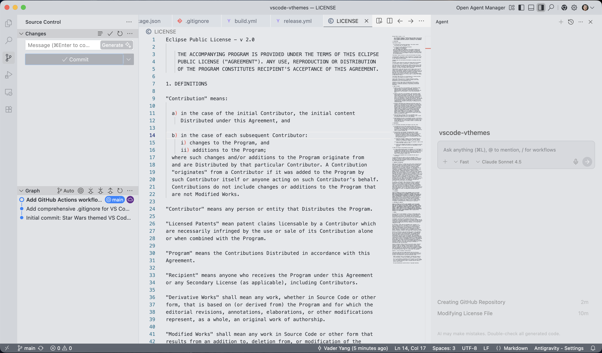
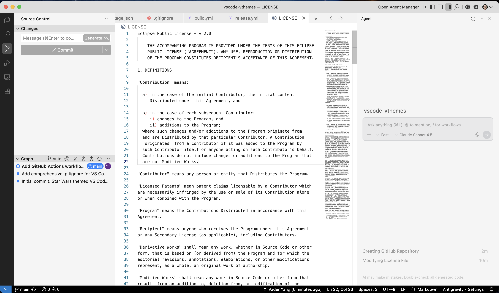
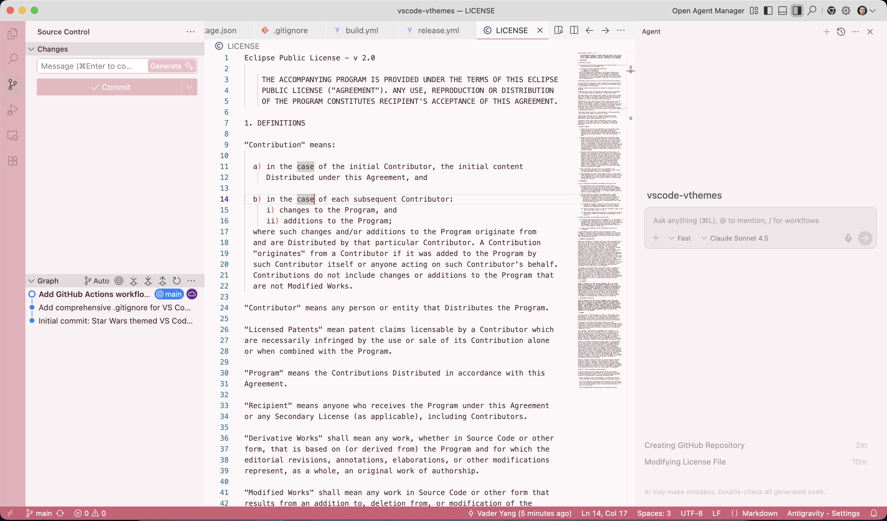
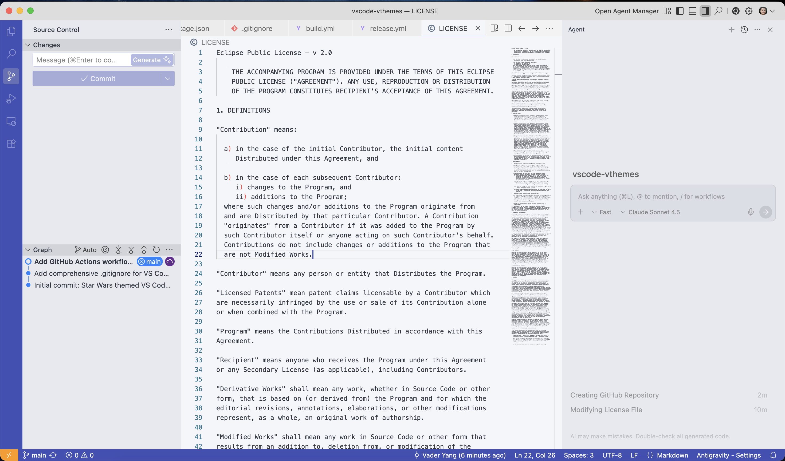
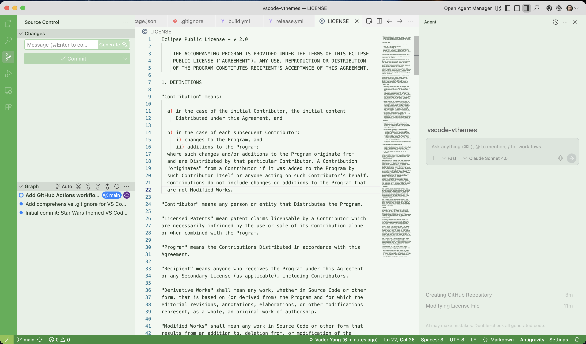
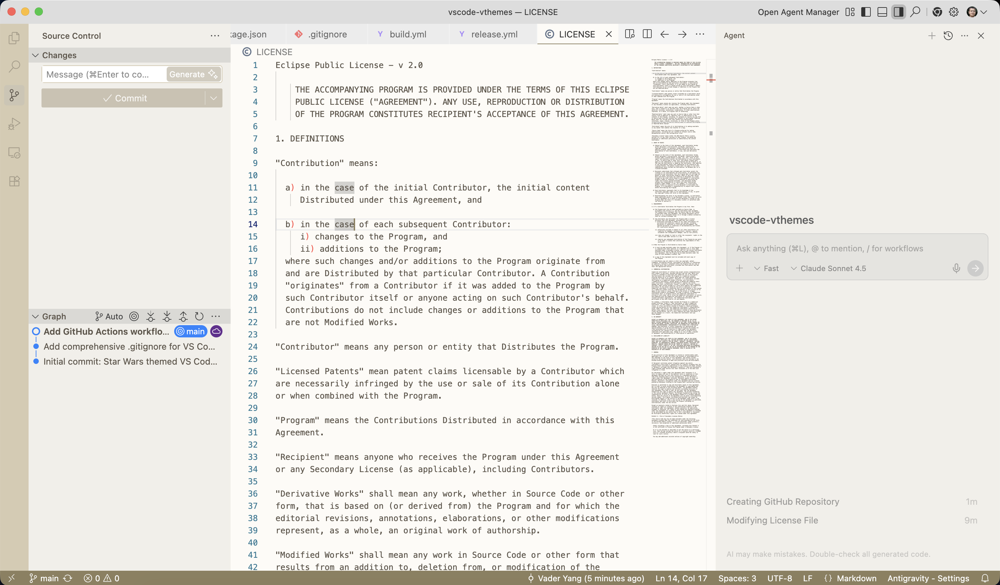
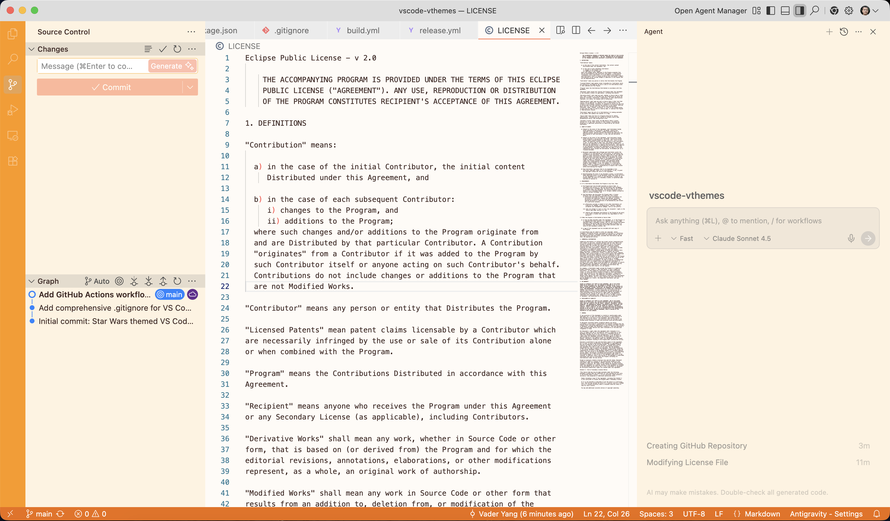
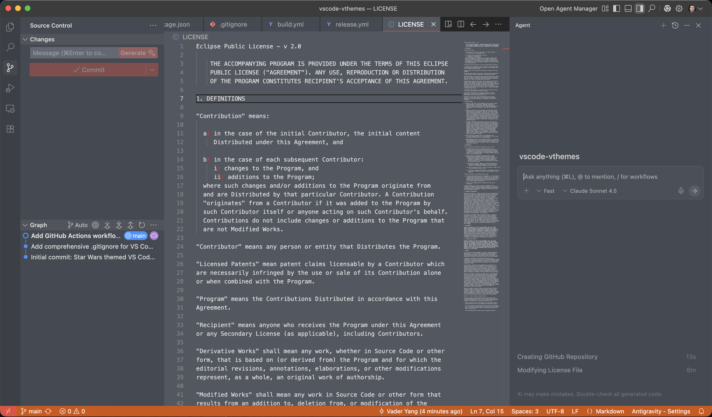
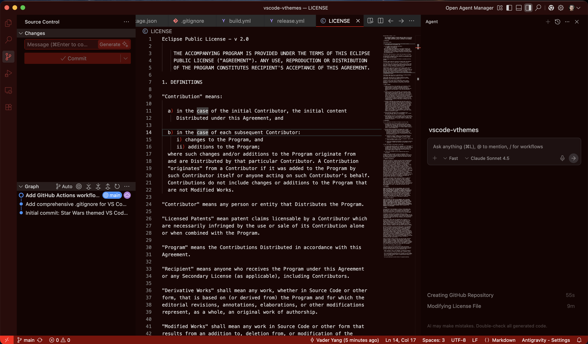

# VTheme Star Wars Pack

**VTheme Star Wars Pack** brings the aesthetics of the MeetingMind application to your VS Code editor. This collection features 9 professionally crafted themes inspired by the iconic characters and factions of the Star Wars universe.

From the metallic precision of **Mando Steel** to the deep, velvet darkness of **Empire Gray**, there is a theme for every ally in the galaxy.

## Preview

### Light Themes

| Mando Steel | Clone White | Padmé Rose |
|-------------|-------------|------------|
|  |  |  |

| Kenobi Blue | Yoda Green | Jedi Light | Rebel Orange |
|-------------|------------|------------|--------------|
|  |  |  |  |

### Dark Themes

| Empire Charcoal | Falcon Gray | Sith Dark |
|-----------------|-------------|-----------|
|  |  |  |

## Themes Included

### Light Themes
*   **VTheme Mando Steel** 🛡️
    *   A premium **Silver & Beskar** aesthetic. Light metallic backgrounds with slate grey contrasts. This is the way.
*   **VTheme Clone White** ⚪
    *   High-contrast, sterile white. Clean, efficient, and uniform.
*   **VTheme Padmé Rose** 🌸
    *   Soft, elegant pinks and warm regal tones. Diplomatic and refined.
*   **VTheme Kenobi Blue** 🟦
    *   Calm, clear blues and cool greys. A civilized theme for a more civilized age.
*   **VTheme Yoda Green** 🌿
    *   Natural, earthy greens. Balanced it is.
*   **VTheme Jedi Light** 🧘
    *   Earthy tans and focused light tones. For those who seek balance.
*   **VTheme Rebel Orange** 🔥
    *   Energetic orange highlights on a warm light background. Spark the rebellion.

### Dark Themes
*   **VTheme Empire Charcoal** ⚫
    *   Deep charcoal and velvet aesthetics. Powerful, commanding, and easy on the eyes.
*   **VTheme Falcon Gray** 🦅
    *   Rugged, industrial slate. She may not look like much, but she's got it where it counts.
*   **VTheme Sith Dark** 🔴
    *   Menacing blacks and aggressive reds. Utilize your anger; code with passion.

## Installation

1.  Open **VS Code**.
2.  Go to **Extensions** (Cmd+Shift+X).
3.  Search for **VTheme Star Wars Pack** (once published, currently not ready) OR install the `.vsix` manually (Download the vsix file in release first).
4.  Click **Install**.

5.  Press `Cmd+K` then `Cmd+T` to select your theme!

## License

MIT
